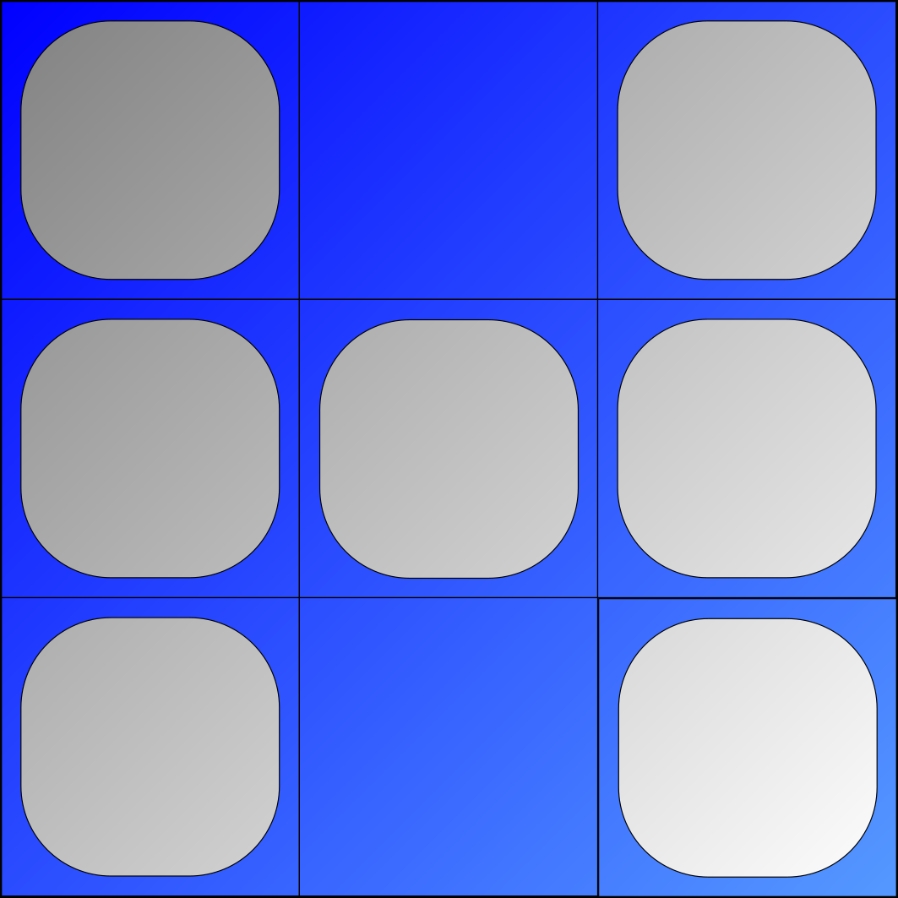

# HolorLib: multi-dimensional containers for C++
Page under construction

<!-- Logo -->

  

HolorLib is a C++20 header only library that implements generic multi-dimensional containers.s
-----------------

## Easy to use

----------------

## Documentation
HolorLib has a [documentation page](https://cmas1.github.io/HolorLib) that contains information on the library and how to install it, tutorials and a list of classes and functions from the public API.
