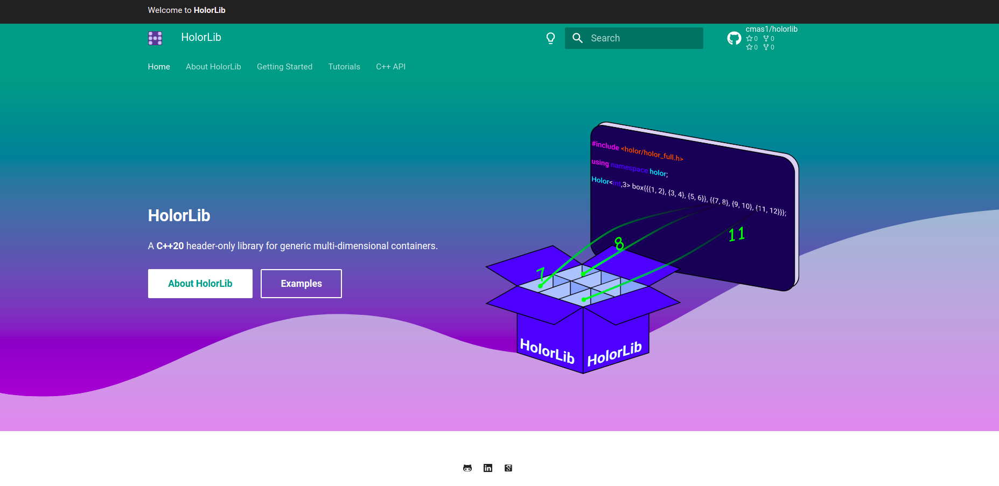

<!-- Logo -->
<p align="center">
  <a href="https://cmas1.github.io/HolorLib/">
    
  </a>
</p>


HolorLib is a C++20 header only library that implements generic multi-dimensional containers. Want to create a vector of floats? A matrix of strings? A 5-dimensional container of some user defined type. HolorLib allows to do it and it provides functionalities to access and slice these containers.
**HolorLib is not a mathematical library**: the objects stored in the containers can be any type, so it would not be 


-----------------


## Easy to use
Creating a multi dimensional container with HolorLib is very simple.

```cpp
  #include <holor/holor_full.h>

  using namespace holor;

  Holor<int,3> some_tensor{{{1,2,3},{4,5,6}}, {{7,8,9},{10,11,12}}};
  //this is a 2x2x3 container of ints.
  std::cout << some tensor << "\n"; //prints the tensor
```

Accessing the elements is just as easy:
```cpp
  auto some_element = some_tensor(1, 0, 2);
  //this is the element at coordinates (1, 0, 2), that is 9

  some_tensor(0,0,0) = 99;
  //now the first element in the container has been changed from 0 to 99
```

One can also slice these containers:
```cpp
  auto some_slice = some_tensor( range(0,1), range(0,1), 1);
  //this is a 2x2 submatrix from the original tensor
  std::cout << some_slice << "\n";
  //prints [ [2, 5], [8, 11]]

  auto some_row = some_tensor.row(0);
  //some_row is the first row from the tensor, i.e., [[99, 2, 3], [4, 5, 6]]
```

----------------


## Ready to get started?
Ready to get started using HolorLib? The official HolorLib [documentation page](https://cmas1.github.io/HolorLib) contains information on the library and how to install it, tutorials and a list of classes and functions from the public API.



----------------


## MIT License

Copyright 2020-2021 Carlo Masone

Permission is hereby granted, free of charge, to any person obtaining a copy
of this software and associated documentation files (the "Software"), to 
deal in the Software without restriction, including without limitation the
rights to use, copy, modify, merge, publish, distribute, sublicense, and/or
sell copies of the Software, and to permit persons to whom the Software is 
furnished to do so, subject to the following conditions:

The above copyright notice and this permission notice shall be included in
all copies or substantial portions of the Software.

THE SOFTWARE IS PROVIDED "AS IS", WITHOUT WARRANTY OF ANY KIND, EXPRESS OR
IMPLIED, INCLUDING BUT NOT LIMITED TO THE WARRANTIES OF MERCHANTABILITY,
FITNESS FOR A PARTICULAR PURPOSE AND NONINFRINGEMENT. IN NO EVENT SHALL THE
AUTHORS OR COPYRIGHT HOLDERS BE LIABLE FOR ANY CLAIM, DAMAGES OR OTHER
LIABILITY, WHETHER IN AN ACTION OF CONTRACT, TORT OR OTHERWISE, ARISING 
FROM, OUT OF OR IN CONNECTION WITH THE SOFTWARE OR THE USE OR OTHER 
DEALINGS IN THE SOFTWARE.