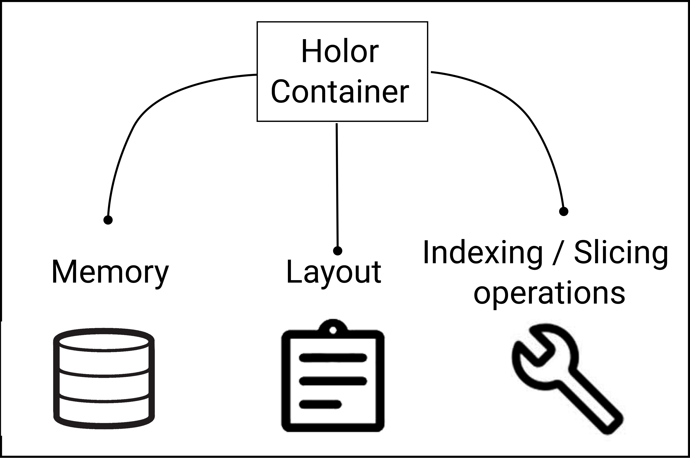
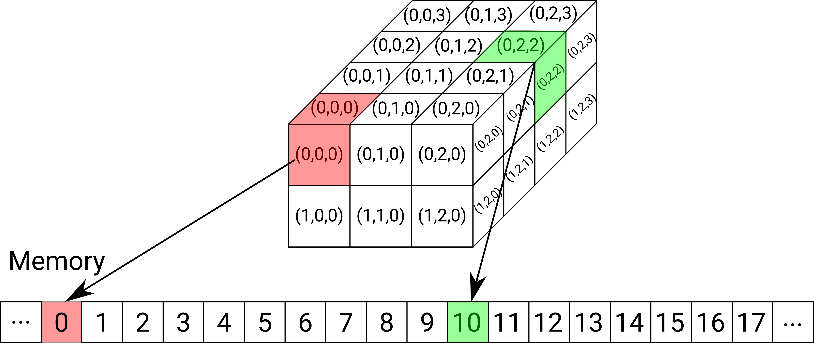
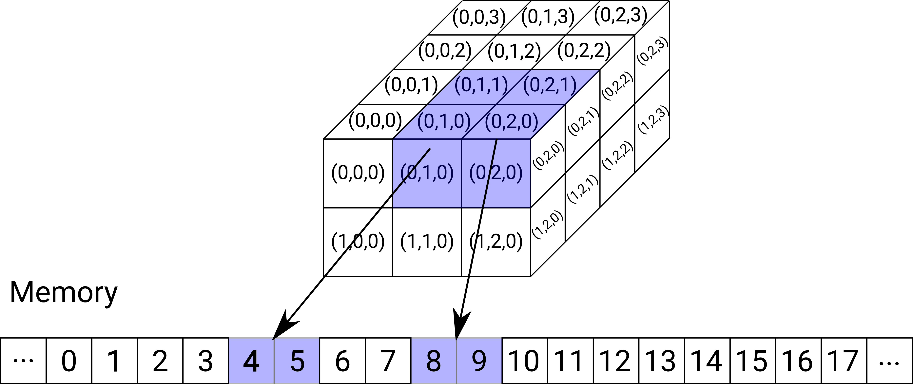

# What's a Holor container?
Holor containers are generic multi-dimensional containers whose elements are stored in a contiguous memory location. Namely, given the start (pointer) of the area of memory, the location of the stored elements with respect to this initial point is defined by a single index even though the container itself may be multi-dimensional. 
In particular, we use a [row-major ordering](https://en.wikipedia.org/wiki/Row-_and_column-major_order).
The correspondance between the shape of the multi-dimensional container and the locations in memory of the stored elements is provided by a *Layout*.
The Layout is an object, present in each Holor container, that has the information needed to establish a map from the multi-dimensional coordinates (indices) in the container to a memory location, and viceversa.

<figure>
  
  <figcaption>Holor containers ...</figcaption>
</figure>


## Memory
HolorLib containers are collections of objects stored in a contiguous memory according to a Layout. The library provides two different types of containers, which differentiate from each other for the ownership of the storage:

* A ``Holor` is a container that takes ownership of the memory location where the elements are stored.
* A ``HolorRef`` is a non-owning Holor-like view over a sequence of elements stored in a (nearly) contiguous [#f1]_ storage. This storage may be given as a pointer that is manually allocated or it may be owned by some other object (for example a vector or an array).


## Layout
A Layout contains three fundamental pieces of information: 

- **Offset**: is the displacement in the contiguous memory of the first element indexed by the layout from the beginning of the memory.  
- **Lengths**: are the numbers of elements along every dimension of the layout.
- **Strides**: are the distances in the 1D data sequence between successive elements in individual dimensions of the layout.

For a Layout with `N` dimensions, both the length array and the stride array must have size `N`.

For a generic `N` dimensional holor container, the total number of elements stored is 
\begin{equation}
    size = \prod_{i=0}^{N-1} lengths[i]
\end{equation}

The index of the memory location corresponding to the element of the container  with coordinates $(c_0, \ldots, c_{N-1})$ is 
\begin{equation}
    index = offset + \sum_{i=0}^{N-1} c_i \cdot strides[i]
\end{equation}


## Indexing and Slicing operations
Both Holor and HolorRef containers implement operations that allow to index individual elements of the container, accessing the memory location where they are stored,  or to **slice** parts of it yielding a new view (i.e. a HolorRef) over the selected part of the container.

The indexing and slicing operations have a simple sintax common to many scripting languages. For example, one can write 

``` cpp
    using namespace holor;
    Holor<int,2> A = {{1,2,3,4},{5,6,7,8},{9,10,11,12}}; // 3-by-4 matrix of integers
    auto c = A(2,3); // c has the value 8. 
    auto B = A(range(0,1), range(2,3)); // B is a 2-by-2 HolorRef that views the elements {{3,4}, {7,8}} of A
```

For more detailed examples refer to the section Tutorials.


#### Example: indexing

Consider a :math:`2 \times 3 \times 4` Holor.

<figure>
  
  <figcaption>Indexing example</figcaption>
</figure>

The container has 24 elements which are stored contiguously. The Holor's Layout is:

* offset = 0
* lengths = [2, 3, 4]
* strides = [12, 4, 1]

Therefore, the element with coordinates (0,0,0) is located in the memory area at the location :math:`0 + 0 \cdot 12 + 0 \cdot 4 + 0 \cdot 1 = 0`, whereas the element with coordinates (0,2,2) is located in the memory area at the location :math:`0 + 0 \cdot 12 + 2 \cdot 4 + 2 \cdot 1 = 10`


#### Example: slicing

Consider the same :math:`2 \times 3 \times 4` Holor as in the previous example, and suppose that we want to take a 2-by-2 slice corresponding to the first row, last two columns and first two lines in the third dimension.
In code, this would mean 

.. code-block:: cpp

    auto B = A(1, range(0,1), range(0,1)); //suppose that A is the name of the Holor to be sliced

<figure>
  
  <figcaption>Indexing example</figcaption>
</figure>


The slicing operation extracts a subset of the Holor container. Note that these elements are adjacent in the spatial coordinates of the Holor, but they are not all contiguous in memory.

The slicing operation amounts to computing a new Layout that describes the location of the selected elements in the original contiguous memory. The Layout is used to create a HolorRef, i.e. a view over the selected slice.
The Layout corresponding to the selected 2-by-2 slice is:

* offset = 4
* lengths = [2, 2]
* strides = [4, 1]


.. [#f1] the elements in the view are located in a contiguous storage, but the elements themselves may not be contiguous because the view may exclude some of the items in the stored sequence, e.g. when taking a slice of a Holor.