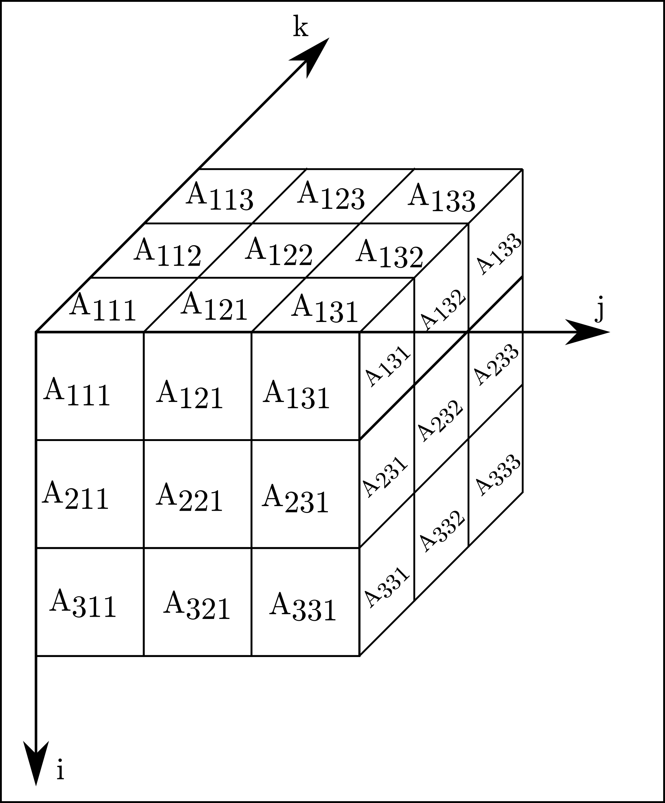

# Origin of the word Holor

The name of the library pays homage to the work of Parry Moon and Domina Eberle Spencer, who coined the term *Holor*:

> The word holor indicates a mathematical entity that is made up of one or more independent quantities. Examples of holors are complex numbers, vectors, matrices, tensors, and other hypernumbers.
> 
> -- <cite>Parry Moon and Domina Eberle Spencer <cite> [^1]

Namely, Moon and Spencer define holors (from the Greek *ὅλος*, a whole) as a collection of indipendent elements, or merates (from the Greek *μέρος*, a part). These mathematical objects have two fundamental qualities:

- **valence** $N$: which indicates the **number of dimensions**.
- **plethos** $n_i$: which indicates the **number of elements** in the $i$-th dimension.
   
A simple example of a holor is a 3D matrix $A_{ijk}$, with three elements in each direction ($N=3$ and $n=3$ along all axes), as shown in this figure

<figure>
  
  <figcaption>Holor example: a 3D matrix</figcaption>
</figure>

   
The elements of this holor are identified by the three indices, $i$, $j$ and $k$. 

The theory of Holors developed by Moon and Spencer not only provides a generic notation for referring to such collection of elements, but it also generalizes algebraic operations like addition and product, transformations and calculus with these entities. They also provide definitions to important classes of holors, like tensors, akinetors, oudors. 

This library does not aim to implement these concepts: ==**HolorLib is not a mathematical library**==. HolorLib only implements generic multidimensional containers, characterized by a number of dimensions (aka the *valence*) and by a number of elements along each dimension (aka the *plethos*). The elements stored in this container may be objects of any type, not just numbers or other mathematical entities. We call this containers *holors* because inspired by Moon and Spencer's work.
HolorLib provides fundamental operations to manipulate and access these containers, such as indexing and slicing. Other operations to manipulate the containers and their content, such as addition or product, are typically application specific and are not implemented in this library interface.

!!! note "Thank you"
    If you are using Holor as part of your research, teaching, or other activities, we would be grateful if you could star
    the repository.

[^1]: Parry Moon and Domina Eberle Spencer, *Theory of Holors: a generalization of tensors*, Cambridge, England: Cambridge University Press, 1986