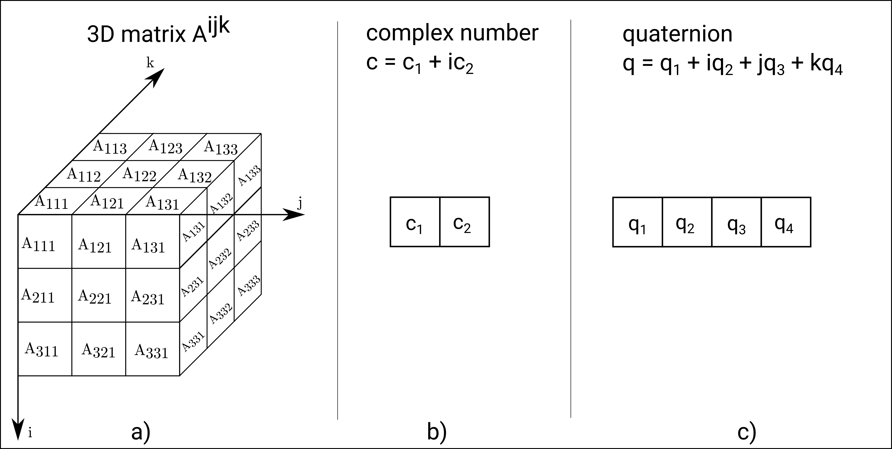

# Origin of the word Holor

The name of the library pays homage to the work of Parry Moon and Domina Eberle Spencer, who coined the term *Holor*:

> The word holor indicates a mathematical entity that is made up of one or more independent quantities. Examples of holors are complex numbers, vectors, matrices, tensors, and other hypernumbers.
> 
> -- <cite>Parry Moon and Domina Eberle Spencer <cite> [^1]

Moon and Spencer define holors (from the Greek *ὅλος*, a whole) as collections of indipendent elements, or merates (from the Greek *μέρος*, a part). In their definition, holors are characterized by two fundamental qualities:

- **valence** $N$: which indicates the **number of dimensions**.
- **plethos** $n_i$: which indicates the **number of elements** in the $i$-th dimension.

Moon and Spencer also introduce a general index notation to identify the merates of a holor: a single dimensional holor with three merates is denoted as $v^i = (v^1, v^2, v^3)$, a bi-dimensional holor with $2 \times 2$ elements is denoted as $A^{ij} = (A^{1,1}, A^{1,2}, A^{2,1}, A^{2,2})$, and so on.
The definition of holors is purposedly broad so as to encompass under a unique formulation a large number of mathematical entities, such as matrices, tensors, complex numbers, quaternions, etcetera. Figure 1 illustrates some examples of holors. 

<figure>
  
  <figcaption><b>Figure 1</b>: Some examples of holors: a) a 3D matrix; b) a complex number; c) a quaternion.</figcaption>
</figure>

   
The *Theory of Holors* goes further to elaborate an algebra of holors, an operation called $\gamma$-product that allows to modify the characteristics (valence, positions of indices, symmetry or antisymmetry) of holors, transformations. It also provides definitions for notable classes of holors, like tensors, akinetors, oudors. 

This library does not aim to implement these concepts: **HolorLib is not a mathematical library**, but it implements generic multidimensional containers of objects. These objects may be standard types, such as `floats`, `ints` or `vector<double>`, or user defined types such as a `struct`. Inspired by Moon and Spencer's work, we call this containers `Holor` and `HolorRef`.
HolorLib provides fundamental operations to manipulate and access these containers, such as indexing and slicing. Other operations to manipulate the containers and their content, such as addition or product, are typically application specific and are not implemented in this library interface.

[^1]: [Parry Moon and Domina Eberle Spencer, *Theory of Holors: a generalization of tensors*, Cambridge, England: Cambridge University Press, 1986](https://www.cambridge.org/core/books/theory-of-holors/A4F6FE2D43AAE06C4D3EF6B620932CCD)