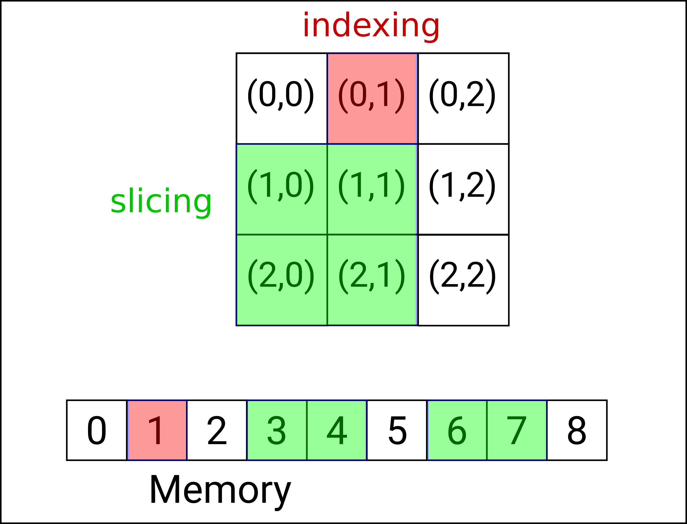

# Layout Basics

## Construction and assignment of Layouts

A layout can be constructed without arguments. In this case its lengths and strides are initalized to zero:
```cpp hl_lines="3"
    #include <Holor/holor/holor_full.h>
    using namespace holor;
    Layout<2> my_layout;

    std::cout << "the dimensions of the layout are " << my_layout.dimensions() << std::endl; // This prints 2
    std::cout << "the lenghts of the layout are " << my_layout.length(0) << " "  << my_layout.length(1) << std::endl; // This prints 0 0
    std::cout << "the strides of the layout are " << my_layout.stride(0) << " "  << my_layout.stride(1) << std::endl; // This prints 0 0
    std::cout << "the size of the layout is " << my_layout.size() << std::endl; // This prints 0
```
<hr style="background-color:#9999ff; opacity:0.4; width:50%"> 

A layout can also be constructed specifying its lengths
```cpp hl_lines="3 4 5"
    #include <Holor/holor/holor_full.h>
    using namespace holor;
    Layout<2> my_layout1{2, 3};
    Layout<2> my_layout2(std::vector<size_t>{2, 3});
    Layout<2> my_layout3(std::array<int, 2>{2, 3});

    //These three examples of constructor yield the same result

    std::cout << "the dimensions of the layout are " << my_layout1.dimensions() << std::endl; // This prints 2
    std::cout << "the lenghts of the layout are " << my_layout1.length(0) << " "  << my_layout1.length(1) << std::endl; // This prints 2 3
    std::cout << "the strides of the layout are " << my_layout1.stride(0) << " "  << my_layout1.stride(1) << std::endl; // This prints 3 1
    std::cout << "the size of the layout is " << my_layout1.size() << std::endl; // This prints 6
```

<hr style="background-color:#9999ff; opacity:0.4; width:50%"> 

A layout can also be constructed or assigned from another Layout
```cpp hl_lines="4 5"
    #include <Holor/holor/holor_full.h>
    using namespace holor;
    Layout<3> my_layout1{2, 3, 4};
    Layout<3> my_layout2(my_layout1);
    Layout<3> my_layout3 = my_layout1;

    //my_layout2 and my_layout3 are the same as my_layout1

    std::cout << "the dimensions of the layout are " << my_layout2.dimensions() << std::endl; // This prints 3
    std::cout << "the lenghts of the layout are " << my_layout2.length(0) << " "  << my_layout2.length(1) << " "  << my_layout2.length(2) << std::endl; // This prints 2 3 4
    std::cout << "the strides of the layout are " << my_layout2.stride(0) << " "  << my_layout2.stride(1) << " "  << my_layout2.stride(1) << std::endl; // This prints 0 0 0
    std::cout << "the size of the layout is " << my_layout2.size() << std::endl; // This prints 6
```

## Resizing a Holor
A `Layout` has a fixed number of dimensions, but the number of elements along each dimension can be changed. This is useful when the number of elements needs to be modified over time, or to create an empty container and resize it later.
``` cpp
    #include <Holor/holor/holor_full.h>
    using namespace holor;

    Layout<2> lay; //A Layout with 2 dimensions
    lay.set_lengths(3,2); //Now lay has lengths 3, 2
    lay.set_length(0,2); //This operation modifies only the first length and sets it to 2. Now the lengths are 2, 2
```


## Mapping from indices to location in a memory sequence

Consider a generic 2D Holor container as represented in figure.

<figure>
  
  <figcaption>Example of mapping between Holor coordinates and memory positions. The element indexed in red is stored in the position 3 of the memory. When slicing (green elements) a new Layout referencing to the same memory is created.</figcaption>
</figure>

The container uses a Layout to map from from its indices to the position in the memory area where the element is stored. The function that implements this mapping is the `#!cpp operator()`.
``` cpp hl_lines="12 13"
    #include <Holor/holor/holor_full.h>

    using namespace holor;
    
    Layout<2> lay{3,3}; //this is the layout of the container represented in figure above.
    std::cout << lay.dimensions() << std::endln; // lay has 2 dimensions
    std::cout << lay.offset() << std::endln; // lay has offset 0
    std::cout << lay.size() << std::endln; // lay has size 9
    std::cout << lay.length(0) << " " << lay.length(1) << std::endln; // lay has lengths 3, 3
    std::cout << lay.strides(0) << " " << lay.strides(1) << std::endln; // lay has strides 3, 1

    auto id = lay(0,1); // indexing: id is a size_t with value 1.
    auto lay_slice = lay(range(1,2), range(0,1)); // slicing: lay_slice is a new layout that represents the slice with indices ([1, 2], [0, 1]).

    std::cout << lay_slice.dimensions() << std::endln; // lay_slice has 2 dimensions
    std::cout << lay_slice.offset() << std::endln; // lay_slice has offset 3
    std::cout << lay_slice.size() << std::endln; // lay_slice has size 4
    std::cout << lay_slice.length(0) << " " << lay_slice.length(1) << std::endln; // lay_slice has lengths 2, 2
    std::cout << lay_slice.strides(0) << " " << lay_slice.strides(1) << std::endln; // lay_slice has strides 2, 1
```